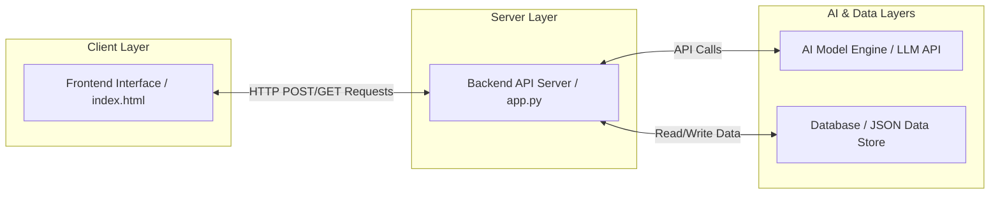

# -AI-chatbot-assistance-
 ai chatbot devlopment built with python and llms api
# AI Chatbot Development Project

An end-to-end AI chatbot application featuring a decoupled frontend interface, a robust backend server layer, and direct integration with an AI model engine.

---

## 🗺️ Project Roadmap & Tasks

### Task 1: Study AI Client-Server Architecture
* **Objective:** Understand the components involved in AI application deployment.
* **Activities:** * Identify Client, Server, AI model, and Database layers.
  * Map out architectural system bounds.
* **Deliverables:** * Architecture Diagram
  * Component Explanation Document

### 📊 System Architecture Diagram
Below is the system boundary map showing how data flows between your components:



### 📄 Component Explanation Document

* **Client Layer (`index.html`)**: The user interface where users input prompts, click submit, view loading animations, and read the chatbot responses.
* **Server Layer (`app.py`)**: The central logic gates built with Python Flask. It accepts network requests from the client, validates inputs, communicates with the data layer, and serves data securely.
* **AI Model Layer**: The core intelligence mechanism processing incoming human language strings to generate contextual chat answers.
* **Database Layer (`data/`)**: The persistent storage space containing raw datasets, chat logs, user information records, and feedback metrics.
s
### Task 2: Design API Endpoints
* **Objective:** Create APIs that expose AI functionality.
* **Proposed Endpoints:**

| Endpoint | Method | Purpose |
| :--- | :--- | :--- |
| `/api/chat` | `POST` | Send prompts to AI |
| `/api/history` | `GET` | Retrieve conversations |
| `/api/users` | `GET` | Fetch user information |
| `/api/feedback` | `POST` | Store ratings |
| `/api/health` | `GET` | Health check |

* **Deliverables:** API Specification Document & Endpoint Table

### Task 3: Develop Backend Server
* **Objective:** Build the server layer.
* **Activities:** Use Node.js with Express (or Python Flask) to handle routing, request processing, middleware integration, and JSON formatting.
* **Deliverables:** Backend Server Application

### Task 4: Create Frontend Interface
* **Objective:** Develop a user interface for interacting with the AI system.
* **Activities:** Build a responsive web application featuring an input text box, submission controller, conversation response stream, and loading states using React, HTML/CSS, and JavaScript.
* **Deliverables:** Functional Frontend Application

### Task 5: Documentation and Demonstration
* **Objective:** Technical documentation and project validation.
* **Deliverables:**
  * Technical Report
  * Sequence Diagram
  * Demo Video

---

## 📄 API Specification Document

This document outlines the request and response structures for the AI Chatbot backend endpoints. All requests and responses use the `application/json` content type.

### 1. Send Prompt to AI
* **Endpoint:** `/api/chat`
* **Method:** `POST`

**Request Body:**
```json
{
  "user_id": "user_12345",
  "prompt": "Hello! Can you explain what an API is?"
}
```
**Response Body (200 OK):**
```json
{
  "status": "success",
  "response": "An API allows different software applications to communicate.",
  "timestamp": "2026-07-07T20:53:00Z"
}
```

### 2. Retrieve Conversations
* **Endpoint:** `/api/history`
* **Method:** `GET`

**Response Body (200 OK):**
```json
{
  "user_id": "user_12345",
  "history": [
    {
      "role": "user",
      "text": "Hello!"
    },
    {
      "role": "assistant",
      "text": "Hi there!"
    }
  ]
}
```

### 3. Fetch User Information
* **Endpoint:** `/api/users`
* **Method:** `GET`

**Response Body (200 OK):**
```json
{
  "user_id": "user_12345",
  "username": "lokarepreethi2"
}
```

### 4. Store Ratings
* **Endpoint:** `/api/feedback`
* **Method:** `POST`

**Request Body:**
```json
{
  "conversation_id": "chat_9988",
  "rating": 5,
  "comments": "Great response!"
}
```
**Response Body (201 Created):**
```json
{
  "status": "feedback_saved"
}
```

### 5. Health Check
* **Endpoint:** `/api/health`
* **Method:** `GET`

**Response Body (200 OK):**
```json
{
  "status": "healthy",
  "services": {
    "database": "connected",
    "ai_engine": "operational"
  }
}
```

---

### Task 3: Develop Backend Server
* **Objective:** Build the server layer.
* **Activities:** 
    * Set up routes using Python Flask framework.
    * Handle HTTP requests securely.
    * Return structured JSON responses using `jsonify()`.
* **Deliverables:** 
    * Running backend server code (`app.py`).
    * Source code repository setup.

---

### Task 4: Create Frontend Interface
* **Objective:** Develop a user interface for interacting with the AI system.
* **Activities:** 
    * Build core input text boxes and interactive submit buttons.
    * Establish persistent response display areas.
    * Configure visual loading indicators for AI latency states.
* **Deliverables:** 
    * Functional client-side web application interface (`index.html`).

---

### Task 5: Documentation and Demonstration
* **Objective:** Document architecture configurations and publish data schema sets.
* **Activities:** 
    * Model explicit endpoint schemas.
    * Map folder trees for structured codebases.
* **Deliverables:** 
    * Technical report deployment documents.
    * Interactive version-controlled file hierarchy trees.

---

### 📂 Repository File System Architecture Diagram (Task 5)
Below is the directory structural tree designed for submission validation tracking:

```text
-AI-chatbot-assistance/
│
├── data/
│   └── sample_intents.json
│
├── app.py
├── index.html
├── .gitignore
├── LICENSE
└── README.md
```

---

### 🌐 Frontend User Interface Source Code (Task 4 Component)
Below is the complete standalone HTML structure designed for the chatbot interface:

```html
<!DOCTYPE html>
<html lang="en">
<head>
    <meta charset="UTF-8">
    <meta name="viewport" content="width=device-width, initial-scale=1.0">
    <title>AI Chatbot Interface</title>
    <style>
        body { font-family: Arial, sans-serif; background-color: #f4f4f9; padding: 20px; }
        .chat-container { max-width: 600px; margin: auto; background: white; padding: 20px; border-radius: 8px; box-shadow: 0 0 10px rgba(0,0,0,0.1); }
        .chat-box { height: 300px; border: 1px solid #ccc; padding: 10px; overflow-y: scroll; margin-bottom: 20px; border-radius: 4px; background: #fafafa; }
        .input-area { display: flex; gap: 10px; }
        input { flex: 1; padding: 10px; border: 1px solid #ccc; border-radius: 4px; }
        button { padding: 10px 20px; background: #007bff; color: white; border: none; border-radius: 4px; cursor: pointer; }
        button:hover { background: #0056b3; }
        .loading { display: none; color: #666; font-style: italic; margin-top: 10px; }
    </style>
</head>
<body>
    <div class="chat-container">
        <h2>AI Chatbot Interface</h2>
        <div class="chat-box" id="chatBox"></div>
        <div class="input-area">
            <input type="text" id="userInput" placeholder="Type your prompt here...">
            <button onclick="sendPrompt()">Submit</button>
        </div>
        <div class="loading" id="loadingIndicator">AI is thinking...</div>
    </div>
    <script>
        function sendPrompt() {
            const input = document.getElementById('userInput');
            const chatBox = document.getElementById('chatBox');
            const loading = document.getElementById('loadingIndicator');
            if (!input.value.trim()) return;
            chatBox.innerHTML += `<p><strong>You:</strong> ${input.value}</p>`;
            loading.style.display = 'block';
            setTimeout(() => {
                loading.style.display = 'none';
                chatBox.innerHTML += `<p><strong>AI:</strong> Interface connected! Ready to process inputs.</p>`;
                chatBox.scrollTop = chatBox.scrollHeight;
                input.value = '';
            }, 1000);
        }
    </script>
</body>
</html>
```

---

# Week 4

## Task 1: Implement Client-Server Communication

### Objective
Connect the frontend to backend APIs.

### Activities
Use:
```javascript
fetch("/api/chat", {
    method: "POST",
    headers: {
        "Content-Type": "application/json"
    },
    body: JSON.stringify({
        prompt: userInput
    })
});
```
Display server responses on the interface.

### Deliverables
Integrated application.

