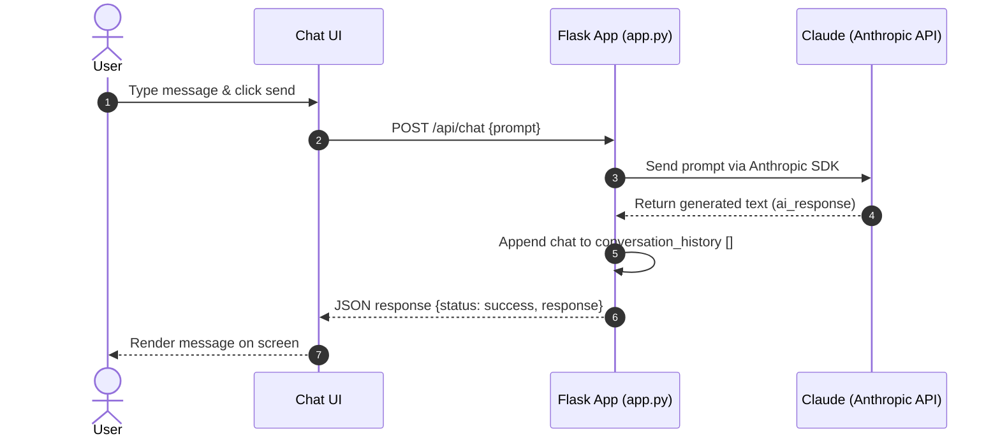

# src/

This folder contains the source code for the AI chatbot backend, including `app.py` and related modules.

## 🛠️ API Documentation

### 1. Chat Endpoint
Interacts with the AI chatbot to get assistant responses.

* **URL:** `/api/chat`
* **Method:** `POST`
* **Headers:** `Content-Type: application/json`

**Request Body Example:**
```json
{
  "prompt": "Hello, how do I build a sequence diagram?"
}
```

**Success Response (200 OK):**
```json
{
  "status": "success",
  "response": "To build a sequence diagram..."
}
```

---

### 2. History Endpoint
Retrieves the stored conversation history of previous chatbot interactions.

* **URL:** `/api/history`
* **Method:** `GET`

**Success Response (200 OK):**
```json
{
  "status": "success",
  "history": [
    {
      "question": "Explain AI",
      "answer": "Artificial Intelligence ..."
    }
  ]
}
```

---

## 🔄 Sequence Diagram

The diagram below illustrates the communication flow during a standard chatbot request:


